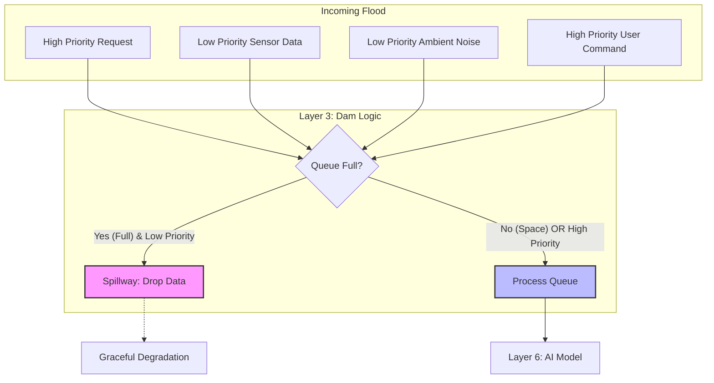

# EXP-01: Bandwidth & Latency Stress Test (“The Narrow Pipe”)

> **Part of the Connector OS Trenchcoat Experiments Suite.**  
> This experiment validates Layer 2 (CMP) and Layer 3 (Dam Logic) under real infra constraints.  
> **Status:** Ready for Implementation  
> **Origin:** Engineering validation prompt (Nov 2025)  
> **Purpose:** Demonstrate how Connector OS maintains graceful degradation under bandwidth, latency, and queue pressure — where typical AI stacks fail catastrophically.

---

## 1. Hypothesis

**The Straw Hypothesis**  
Most AI stacks break not because the model is weak, but because the pipe is narrow.  
If we:  
- shrink bandwidth → payload cannot carry full state  
- increase latency → presence illusion collapses  
- flood queues → system loses prioritization  

…then user-perceived “intelligence” drops sharply, even with the strongest models.

**Connector OS Prediction**  
Connector OS should degrade smoothly, not sharply, because:  
- Layer 2: CMP (Context Map Protocol) compresses state into compact glyphs  
- Layer 3: Dam & Grid Logic batches, drops, routes, and mode-switches under load  
- Real-time ↔ async transitions preserve continuity  
- High-priority signals survive; low-priority ones spill  

The goal isn’t perfection — it’s stability under stress.

---

## 2. The Three Stress Tests

### Test A — Bandwidth Cap (“Alphabet vs Poems”)

**Constraint:**  
Limit outbound + inbound payloads (e.g., ≤ 500 bytes).

**Typical Stack Behavior:**  
- Context truncation  
- Loss of conversational thread  
- Sudden hallucination or drift  
- Model appears “dumber”

**Connector OS Behavior (expected):**  
- Activate Layer 2 CMP  
  - Replace long histories → short glyphs  
    (e.g. {"state": "focus_high", "ctx": "coding_v3"})  
- Switch to sparse prediction mode when compressed  
- Preserve semantic continuity, not verbatim text

**Metric:**  
- Task success rate per KB  
- Drift/hallucination rate vs. payload shrink

### Test B — Latency Injection (“The Lag”)

**Constraint:**  
Inject round-trip delays: 50 ms → 250 → 500 → 1000+.

**Typical Stack Behavior:**  
- Frozen UI  
- User interrupts (“Hello?”)  
- Conversational illusion breaks  
- Users abandon the session

**Connector OS Behavior (expected):**  
- Latency-aware mode switching  
  - <150ms: **Conversational Mode**  
  - >500ms: **Async Mode** (“Processing...”, buffering)  
- Use Layer 3 to throttle and reshape flow  
- Maintain presence even when speed collapses

**Metric:**  
- User interruption events  
- Drop-offs vs. latency band  
- Completion rate vs. delay

### Test C — Queue Flood (“Dam & Spillway Logic”)

**Constraint:**  
Simulate N concurrent requests (1 → 5 → 10 → 50+).

**Typical Stack Behavior:**  
- Queue overload  
- Timeouts / 5xx errors  
- Collapse in throughput  
- No prioritization

**Connector OS Behavior (expected):**  
- Layer 3 Dam Logic  
  - Spillway: drop low-priority items under pressure  
  - Batching: merge redundant sensor inputs  
  - Routing: send slow-path items to local/light models

**Metric:**  
- Uptime vs. queue depth  
- Priority fidelity  
- Latency per class (high vs. low priority)

---

## 3. Minimal Simulation Wrapper (Python)

This wrapper simulates:  
✓ bandwidth limits  
✓ latency injection  
✓ queue pressure  
to evaluate Connector OS adaptive behavior.

```python
import time
import json
from collections import deque

# --- Layer 2: CMP (Compression Stub) ---

def compress_to_glyph(prompt: str, limit: int = 500) -> str:
    """
    Simplified CMP:
    Convert rich text -> compact state glyph.
    Real implementation would map state transitions directly.
    """
    encoded = prompt.encode("utf-8")
    if len(encoded) <= limit:
        return prompt
    return json.dumps({
        "state": "compressed",
        "excerpt": prompt[:limit // 2],
        "meta": "truncated"
    })


# --- Layer 3: Dam Logic (Spillway + Batching) ---

class DamLogic:
    def __init__(self, max_queue: int = 10):
        self.queue = deque(maxlen=max_queue)
        self.max_queue = max_queue

    def process(self, request: str, priority: int = 1):
        """
        High priority (>=2) always admitted.
        Low priority dropped when overflow occurs.
        """
        if len(self.queue) >= self.max_queue and priority < 2:
            return None  # Spillway drop
        self.queue.append(request)
        return f"Processed (depth={len(self.queue)})"


# --- Combined Narrow Pipe Simulator ---

class NarrowPipe:
    def __init__(self):
        self.dam = DamLogic(max_queue=10)

    def test_bandwidth(self, prompt: str, limit: int = 500):
        payload = compress_to_glyph(prompt, limit)
        return f"Payload bytes={len(payload.encode('utf-8'))}"

    def test_latency(self, delay_ms: float = 0.0):
        time.sleep(delay_ms / 1000)
        mode = "ASYNC" if delay_ms > 500 else "REALTIME"
        return f"Mode={mode}, latency={delay_ms}ms"

    def test_queue(self, prompt: str, priority: int = 1):
        result = self.dam.process(prompt, priority)
        return result or "Dropped (spillway)"


# Example run:

if __name__ == "__main__":
    np = NarrowPipe()
    print(np.test_bandwidth("X" * 2000))
    print(np.test_latency(600))
    print(np.test_queue("urgent", priority=2))
```



**The Physics Analogy**  
This diagram perfectly illustrates the "Dam & Spillway" concept. Just like a hydroelectric dam manages water pressure, Connector OS manages information pressure. When the reservoir (Queue) is full, the Spillway opens to release the excess (Low Priority Data) safely, ensuring the Generator (The AI Model) doesn't get destroyed by the flood.

---

## 4. Expected Outcomes

**Connector OS vs. Traditional Stack:**

| Stress             | Traditional AI              | Connector OS                  |
|--------------------|-----------------------------|-------------------------------|
| Bandwidth cap     | Sudden thread loss          | CMP preserves state via glyphs |
| Latency spike     | Frozen UX, frustration      | Mode-switch to async, stable UX |
| Queue flood       | Timeouts, collapse          | Spillway + batching, graceful loss |

Connector OS should show smooth degradation curves rather than catastrophic breaks.

---

## 5. Contribution Path

**Developers**  
- Replace mock calls with real LLM APIs  
- Add structured glyph compression  
- Integrate latency-aware UI  

**Researchers**  
- Add new metrics (signal fidelity, cognitive flow continuity)  
- Run cross-model comparisons  

**Everyone**  
- Star the repo  
- Share results or extensions  

---

## 6. Why This Matters

This experiment reframes the AGI debate:  
It’s not “Can the model think?”  
It’s “Can the wiring carry the thought?”  

Connector OS is our proposal for a wiring-first architecture.  
