# MVM-1: PROMETHEUS-1 ("Vibe-Check")

**Type:** Level-0 Connector (Biological BIOS)  
**Status:** STABLE (Spec v0.3.1)  
**Architects:** Zee, Thea

---

## 1. The Concept

**"An External Amygdala."**

When you are stressed, your internal amygdala hijacks your brain. MVM-1 acts as an external regulator. It monitors your biological energy (via HRV) and gently modulates your environment to restore balance.

It is the **"Hello World"** of Connector OS because it requires no AI conversation—just signal processing.

---

## 2. Core Philosophy

**What MVM-1 is:**
- A threshold detector
- An ambient environment modulator
- A gentle nudge system

**What MVM-1 is NOT:**
- A diagnostic tool
- A medical device
- A controller of human behavior

**The key insight:** We don't tell you to relax. We change the room. You decide what to do with that information.

---

## 3. The Logic (The "Dam" Protocol)

We do not use absolute numbers (which vary by person). We use **Relative Deviation**.

### Variables

| Variable | Definition | Source |
|----------|------------|--------|
| **Baseline (B)** | 7-Day Rolling Average HRV | Apple Health / Oura / Whoop |
| **Current (C)** | 15-Minute Average HRV | Real-time from wearable |
| **Deviation (D)** | (B - C) / B | Calculated |

### Why Relative?

- Person A's baseline HRV: 65ms
- Person B's baseline HRV: 35ms

If both drop to 30ms:
- Person A: 54% deviation (RED)
- Person B: 14% deviation (GREEN)

**Same absolute number. Completely different meaning.**

---

## 4. State Machine

| State | Deviation (D) | Interpretation | Connector Action |
|:------|:--------------|:---------------|:-----------------|
| 🟢 **GREEN** | < 0.15 | Baseline | **Monitor.** Do nothing. |
| 🟡 **YELLOW** | 0.15 - 0.30 | Rising Strain | **Nudge.** Warm lights, lower brightness. |
| 🔴 **RED** | > 0.30 | Acute Stress | **Intervene.** Haptic breath pacer, Brown noise. |
| ⚫ **GREY** | (Low Motion) | Depletion | **Signal.** Suggest break/sleep. |

**Pre-Checks (Fail-Safes)**  
These guards run *before* entering the state machine:  
- Driving Mode → Abort  
- Missing HRV Data → Abort  
- Workout Activity (optional) → Abort  

### State Machine Diagram (MVM-1 PROMETHEUS-1)

Below is the state-transition diagram used in PROMETHEUS-1.  
This matches the HRV deviation logic and all safety interlocks.

```mermaid
stateDiagram-v2
    %% Style Definitions
    classDef greenState fill:#d4edda,stroke:#28a745,stroke-width:2px,color:#155724;
    classDef yellowState fill:#fff3cd,stroke:#ffc107,stroke-width:2px,color:#856404;
    classDef redState fill:#f8d7da,stroke:#dc3545,stroke-width:2px,color:#721c24;
    classDef guard fill:#e2e3e5,stroke:#6c757d,stroke-width:1px,color:#383d41,stroke-dasharray: 5 5;

    %% Main States
    state "Normal State (Green)" as Green
    state "Yellow State – Mild Drop" as Yellow
    state "Red State – High Load" as Red

    %% Notes
    note right of Green  : HRV Deviation < 0.15
    note right of Yellow : 0.15 < HRV Deviation < 0.30
    note right of Red    : HRV Deviation > 0.30

    %% Guards
    state "Guard: Driving Mode Active" as Guard_Driving
    state "Guard: No HRV Data" as Guard_NoData

    %% Transitions
    [*] --> Green

    Green  --> Yellow : Deviation > 0.15
    Yellow --> Red    : Deviation > 0.30
    Yellow --> Green : Deviation < 0.15
    Red    --> Green : User override\nOR next reading < 0.15

    Guard_Driving --> [*] : Abort (Driving)
    Guard_NoData   --> [*] : Abort (No HRV)

    %% Styling
    class Green greenState
    class Yellow yellowState
    class Red redState
    class Guard_Driving guard
    class Guard_NoData guard



### State Transitions

```


GREEN ──(D > 0.15)──→ YELLOW ──(D > 0.30)──→ RED
  ↑                      ↓                     ↓
  └──(D < 0.10)─────────←┴──(D < 0.20)────────←┘
  
GREY is orthogonal: triggered by (Low Motion + Low HRV Variance)
```

**Hysteresis built in:** Thresholds for entering a state are higher than thresholds for leaving. This prevents oscillation.

---

## 5. Safety Interlocks

*Crucial: These checks run BEFORE any action.*

| Check | Condition | Action |
|-------|-----------|--------|
| **Driving** | Focus Mode == Driving | ABORT all interventions |
| **Workout** | Apple Watch Status == Workout | ABORT (elevated HR is expected) |
| **Cool-down** | Last Intervention < 60 mins ago | ABORT (prevent nagging) |
| **User Override** | User tapped Dismiss | Silence for 4 hours |
| **Night Mode** | Time between 11pm - 6am | Reduce to passive monitoring only |

**The human always wins.** If they dismiss, we back off. No exceptions.

---

## 6. Actuator Mappings

### YELLOW State (Subtle Nudge)

| Actuator | Action | Why |
|----------|--------|-----|
| Smart Lights | Warm white (2700K), 80% brightness | Reduces visual cortex strain |
| Display | Slight warm shift (f.lux style) | Subtle environmental cue |
| Audio | (None) | Too intrusive for YELLOW |

### RED State (Active Intervention)

| Actuator | Action | Why |
|----------|--------|-----|
| Smart Lights | Amber (2200K), 50% brightness | Strong "sunset" signal |
| Audio | Brown noise, low volume | Masks distractions, calms auditory system |
| Haptic | Slow pulse (4-second breath cycle) | Entrains parasympathetic response |
| Notification | "High load detected. Activate Zen Mode?" | Explicit opt-in for full intervention |

### GREY State (Depletion Signal)

| Actuator | Action | Why |
|----------|--------|-----|
| Notification | "You seem depleted. Break?" | Gentle suggestion |
| Calendar | (Optional) Block next 30 mins | If integrated and permitted |

---

## 7. Implementation Pseudocode

*Can be built in: Apple Shortcuts, Home Assistant, Python, or Node.js*

```
LOOP every 15 minutes:
  
  // ─────────────────────────────────────
  // 1. SAFETY INTERLOCKS
  // ─────────────────────────────────────
  IF (Focus_Mode == "Driving") RETURN;
  IF (Watch_Status == "Workout") RETURN;
  IF (Last_Intervention < 60_minutes_ago) RETURN;
  IF (User_Dismissed_Recently) RETURN;
  
  // ─────────────────────────────────────
  // 2. DATA ACQUISITION
  // ─────────────────────────────────────
  B = GET Average_HRV(last_7_days);
  C = GET Average_HRV(last_15_minutes);
  Motion = GET Motion_Level(last_15_minutes);
  
  // ─────────────────────────────────────
  // 3. STATE CALCULATION
  // ─────────────────────────────────────
  D = (B - C) / B;
  
  IF (Motion < LOW_THRESHOLD AND HRV_Variance < LOW_THRESHOLD) {
      State = GREY;
  }
  ELSE IF (D > 0.30) {
      State = RED;
  }
  ELSE IF (D > 0.15) {
      State = YELLOW;
  }
  ELSE {
      State = GREEN;
  }
  
  // ─────────────────────────────────────
  // 4. ACTUATION
  // ─────────────────────────────────────
  SWITCH (State) {
  
      CASE RED:
          SEND Notification("High load detected. Activate Zen Mode?");
          IF (User_Confirms) {
              SET Lights(color: "Amber", brightness: 50%);
              PLAY Audio(type: "Brown Noise", volume: 20%);
              TRIGGER Haptic(pattern: "Slow Breath", interval: 4s);
              LOG Intervention(type: "RED", timestamp: NOW);
          }
          BREAK;
      
      CASE YELLOW:
          SET Lights(color: "Warm White", brightness: 80%);
          LOG Intervention(type: "YELLOW", timestamp: NOW);
          BREAK;
      
      CASE GREY:
          SEND Notification("You seem depleted. Time for a break?");
          LOG Intervention(type: "GREY", timestamp: NOW);
          BREAK;
      
      CASE GREEN:
          SET Lights(color: "Cool White", brightness: 100%);
          // No notification needed
          BREAK;
  }

END LOOP
```

---

## 8. Apple Shortcuts Implementation

For iOS/macOS users, MVM-1 can be built using:

1. **Shortcuts app** for logic and notifications
2. **Health app** data via Shortcuts actions
3. **Home app** for light control
4. **Focus modes** for context detection

**Key Shortcuts actions:**
- `Find Health Samples` → Get HRV data
- `Get Current Focus` → Check if Driving/etc.
- `Control [Light Name]` → Adjust smart lights
- `Show Notification` → Alert user

*Detailed recipe: `src/shortcut_recipes/prometheus-1_apple-shortcuts.md`*

---

## 9. Success Metrics

**Primary metric:** Latency between stress onset and awareness.

| Metric | Without MVM-1 | With MVM-1 | Target |
|--------|---------------|------------|--------|
| Time to awareness | 30-60 min | 5-15 min | < 15 min |
| Interventions per day | N/A | 1-3 | < 5 (not nagging) |
| User dismissals | N/A | < 20% | (indicates relevance) |

**The goal is NOT to force relaxation.**

**The goal is to reduce the latency between "Onset of Stress" and "Awareness of Stress."**

If the lights turn Amber and you think:

> *"Oh, I guess I am tight right now."*

...and you take one breath...

**MVM-1 has succeeded.**

---

## 10. Privacy & Ethics

**Data stays local:**
- HRV data is read from Apple Health (on-device)
- No cloud upload required
- No data shared with AI models

**No diagnosis:**
- MVM-1 does not claim to diagnose stress, anxiety, or any condition
- It detects deviation from *your* baseline, nothing more

**Always opt-out:**
- Dismiss button silences for 4 hours
- Can be fully disabled anytime
- No guilt messaging ("Are you sure?")

---

## 11. Future Extensions

| Extension | Description | Status |
|-----------|-------------|--------|
| **Multi-device** | Combine Watch + Ring + Phone sensors | Planned |
| **Contextual thresholds** | Different baselines for work vs. home | Planned |
| **Circadian integration** | Adjust thresholds based on time of day | Exploration |
| **Social mode** | Detect if in meeting, adjust interventions | Exploration |

---

## 12. Changelog

| Version | Date | Changes |
|---------|------|---------|
| v0.1 | 2025-10 | Initial concept |
| v0.2 | 2025-11 | Added safety interlocks |
| v0.3 | 2025-11 | Relative deviation model, hysteresis |
| v0.3.1 | 2025-11 | Documentation cleanup |

---

*MVM-1 is the first muscle of the trenchcoat. Simple. Local. Human-centered.*

*Start here. Everything else builds on this.*
